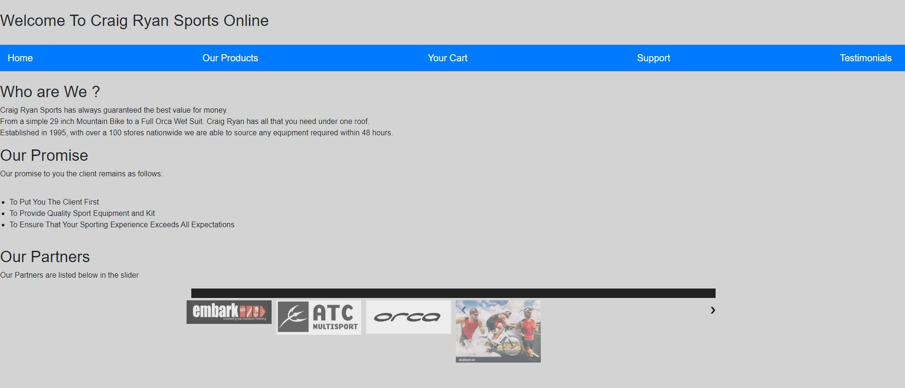

## Craig Wentzel Capstone Project Level 1

## 1. Project Description:

This is a README file that will explain the setup of the CraigRyanShopping Cart.

## 2. Project Outcome:
Project is an Online Shopping Store for Craig Ryan Sport.
Users navigate the site to purchase Bicycles or Running Equipment

## 3. Site Structure:

**The site consists of the following pages:**

*  Default.html - Is the Home Page to the site when users land on this page they can read a general overview of Craig Ryan Sport.
*  Products.html - Is the Product Page that will display the products sold by Craig Ryan Sport.
*  Cart.html - Is where you can view items that you have added to your cart and then proceed to Checkout.
*  Support.html - Is the Support Page for any issues experienced on the site when trying to purchase a product.
*  Testimonial.html - Is where you have client referrals and testimonials to the Services offered by Craig Ryan Sport.

## 4. Installation:

*  Publish all HTML files to the Web Server.
*  Each page has links to the Images folder ensure that the image links are all pointing to the correct locations.
*  Ensure that all Navigation links are correct in the Navigation Toolbar.
*  Ensure that all the CSS Links on the Page is pointing to correct file in the Styles Folder 
*  Ensure that Each JavaScript File reference on each page is pointing to the correct .js File in the .js Folder
*  Ensure that any animation or scroller effect is also pointing to the correct .js File.

## 5. User Adoption: 

Once all pages have been published you should land on Default.html.

The page should render as per below:

         
         
